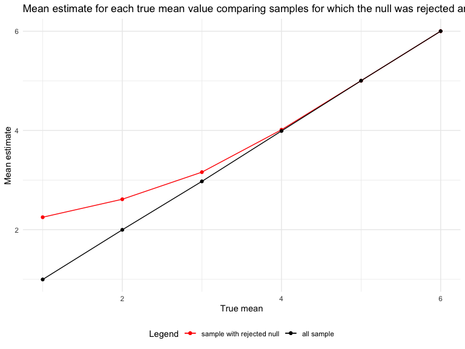

p8105_hw5_ms6360
================
Maisie Sun
2022-11-09

# Problem 1

``` r
data = 
  tibble(
    files = list.files(
      path = "./data/data/", all.files = TRUE,
      full.names = FALSE, recursive = TRUE,
      ignore.case = FALSE, include.dirs = TRUE, no.. = FALSE),
    path = str_c("data/data/", files)
    ) %>%
  mutate(results = map(path, read_csv)) %>% 
  unnest()
```

## Tidy Data

``` r
data_tidy = 
  data %>%
  separate(files, into = c("status", "ID"), sep = "_") %>%
  mutate(
    ID = str_replace(ID, ".csv", "") 
  ) %>%
  select(-path) %>%
  pivot_longer(
    week_1:week_8,
    names_to = "week",
    values_to = "outcome",
    names_prefix = "week_") %>%
  mutate(week = as.numeric(week))
```

## Making a plot

``` r
data_tidy %>% 
  ggplot(aes(x = week, y = outcome, color = status)) + 
  geom_point() + 
  geom_path() + 
  facet_grid(~status)
```


# Problem 2

``` r
homicide_data = 
  read_csv("./data/homicide-data.csv") %>%
  janitor::clean_names()
```

This raw dataset contains 52179 rows and 12 columns, which include
variables uid, reported_date, victim_last, victim_first, victim_race,
victim_age, victim_sex, city, state, lat, lon, disposition. This dataset
reports homicide cases which include victim information, date, location,
and the type of case (disposition), which will be a variable of interest
in the later parts.

``` r
homicide_data_p2 = 
  homicide_data %>%
  unite("city_state", city:state, remove = FALSE, sep = ",") %>%
  group_by(city_state) %>%
  count(disposition, name = "count") %>%
  pivot_wider(
    names_from = "disposition", 
    values_from = "count") %>%
    janitor::clean_names() %>%
  drop_na(open_no_arrest) %>%
  replace(is.na(.), 0) %>%
  mutate(
    total = closed_by_arrest + closed_without_arrest + open_no_arrest,
    unsolved = closed_without_arrest + open_no_arrest
  )
```

This dataset was cleaned using `group_by()` and summarized using
`count()`. After summarizing the counts, the total and unsolved cases
were calculated using `pivot_wider()` and `mutate()`.

``` r
prop.test(
  homicide_data_p2 %>% filter(city_state == "Baltimore,MD") %>% pull(unsolved),
  homicide_data_p2 %>% filter(city_state == "Baltimore,MD") %>% pull(total)) %>% 
  broom::tidy()
```

    ## # A tibble: 1 × 8
    ##   estimate statistic  p.value parameter conf.low conf.high method        alter…¹
    ##      <dbl>     <dbl>    <dbl>     <int>    <dbl>     <dbl> <chr>         <chr>  
    ## 1    0.646      239. 6.46e-54         1    0.628     0.663 1-sample pro… two.si…
    ## # … with abbreviated variable name ¹​alternative

``` r
prop_results = 
  homicide_data_p2 %>% 
  mutate(
    tests = map2(.x = unsolved, .y = total, ~prop.test(x = .x, n = .y)),
    broom = map(.x = tests, ~broom::tidy(.x))
  ) %>% 
  select(-tests) %>% 
  unnest(broom) %>% 
  select(city_state, estimate, starts_with("conf"))
```

``` r
plot = 
  prop_results %>% 
  ggplot(aes(x = fct_reorder(city_state, estimate), y = estimate)) +
  geom_point() + 
  geom_errorbar(aes(ymin = conf.low, ymax = conf.high)) + 
  theme(axis.text.x = element_text(angle = 90, vjust = 0.5, hjust = 1)) + 
  labs(
    title = "Proportion estimate of unsolved cases based on city and states ordered basd on estimates",
    x = "city and state",
    y = "proportion estimate and 95% confidence interval")

plot
```


``` r
ggsave("result/p2_proportion_plot.pdf", plot, width = 20, height = 10)
```

# Problem 3

1 - Creating function for a t-test

``` r
ttest = function(mean, size=30, sigma = 5) {
  
  sim_data = tibble(
    x = rnorm(n = size, mean, sd = sigma),
  )
  
    t.test(sim_data) %>%
    broom::tidy() %>%
    select(estimate,p.value)
}
```

2 - Simulating 5000 datasets when μ = 0

``` r
expand_grid(
  means = 0,
  iteration = 1:5000
) %>%
  mutate(
    estimate_df = map(means, ttest)
  ) %>%
  unnest(estimate_df)
```

    ## # A tibble: 5,000 × 4
    ##    means iteration estimate p.value
    ##    <dbl>     <int>    <dbl>   <dbl>
    ##  1     0         1   -0.197  0.836 
    ##  2     0         2    0.441  0.695 
    ##  3     0         3    0.846  0.448 
    ##  4     0         4   -1.87   0.0234
    ##  5     0         5    2.08   0.0680
    ##  6     0         6   -0.306  0.770 
    ##  7     0         7    0.259  0.731 
    ##  8     0         8    1.92   0.0183
    ##  9     0         9   -0.177  0.829 
    ## 10     0        10    0.141  0.901 
    ## # … with 4,990 more rows

3 - Simulating 5000 datasets when μ = 1, 2, 3, 4, 5, 6

``` r
sim_results_df = 
  expand_grid(
    means = c(1, 2, 3, 4, 5, 6),
    iter = 1:5000
  ) %>% 
  mutate(
    estimate_df = map(means, ttest)
  ) %>%
  unnest(estimate_df)
```

4 - Creating a plot looking at the power of the t-test for each true
mean value

``` r
power_plot = 
  sim_results_df %>%
  group_by(means) %>%
  summarize(
    proportion = sum(p.value < 0.05, na.rm = TRUE)/5000
  ) %>%
  ggplot(aes(x = means, y = proportion)) + 
    geom_point() + 
  geom_line() +
  labs(
    title = "Power of t-test for each true mean value",
    x = "True mean",
    y = "Power"
  )

power_plot
```


``` r
ggsave("result/p3_power_plot.pdf", power_plot, width = 20, height = 10)
```

With a true mean being small and close to 0, which is the null
hypothesis (H0: mu = 0), the effect size is small, which we can expect
the power to be small as well. As the true mean increases and gets
further from 0, the effect size increases and power also increases. When
the true mean is greater or equal to 4, the power is close to 1.

5 - Creating mean estimate for every true mean value

``` r
estimate_plot = 
  sim_results_df %>%
  group_by(means) %>%
  summarize(
    estimate_mean = mean(estimate)
  )
```

6 - Creating overlay plot with mean estimate for every true mean value
for all samples and for samples for which the null was rejected only

``` r
reject_sample_estimate_plot = 
  sim_results_df %>%
  filter(p.value < 0.05) %>%
  group_by(means) %>%
  summarize(
    estimate_mean = mean(estimate)
  ) %>%
  ggplot(aes(x = means, y = estimate_mean, color = "sample with rejected null")) + 
    geom_point() + 
  geom_line() +
  geom_point(data = estimate_plot, aes(color = "all sample")) +
  geom_line(data = estimate_plot, aes(color = "all sample")) +
  scale_color_manual(
    name = "Legend",
    breaks = c("sample with rejected null", "all sample"),
    values = c("sample with rejected null" = "red", "all sample" = "black")) +
  labs(
    title = "Mean estimate for each true mean value comparing samples for which the null was rejected and for all samples",
    x = "True mean",
    y = "Mean estimate",
  )

reject_sample_estimate_plot
```



``` r
ggsave("result/p3_estimate_plot.pdf", reject_sample_estimate_plot, width = 20, height = 10)
```

Is the sample average of mu across tests for which the null is rejected
approximately equal to the true value of μ? Why or why not?

When the true value of mu is small, the sample average of mu across
tests for which the null is rejected is larger than the true value of mu
(overestimation). As the true value of mu increases, the sample average
of mu across tests for which the null is rejected approaches the true
value of mu. For when the true value of mu is larger than or equal to 4,
the mean estimate is really close to the true value of mu.

This is because we are testing the null hypothesis of mu=0. With mu
being 1, the effect size is really small, so the power is small and we
would expect less proportion of sample average of mu to reject the null
hypothesis. When mu is 6, the effect size is large, so the power
increase and that’s why the sample average of mu across tests for which
the null is rejected is similar to the true value of mu.
